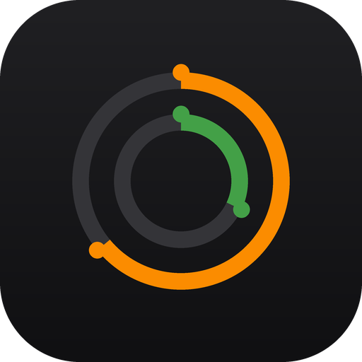
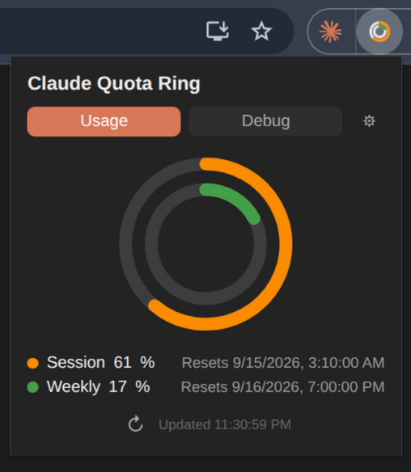

# Claude Quota Ring

<p align="center"></p>

[English](README.md) | [繁體中文](README.zh-TW.md) | [简体中文](README.zh-CN.md) | [日本語](README.ja.md)

**No API key. No login token. No authorization of any kind.**

A tiny Chrome extension that shows your [claude.ai](https://claude.ai) session (5-hour) and weekly (7-day) usage as a dual-ring badge on the toolbar — without ever asking for your credentials, without storing a token, and without calling any Anthropic API itself.

  

---

## Screenshot

<p align="center"></p>

## Why only Claude?

Because I only pay for Claude Pro! (Just kidding.)

Other usage trackers cover many AI providers at once by having the background worker read your cookies and call each provider's API directly with your session — that's exactly the trust model this project avoids. Doing it safely instead — without ever touching a cookie or issuing our own authenticated request — means reverse-engineering and maintaining a separate undocumented usage endpoint per site, and most people don't run all of those services anyway. So this project stays scoped to claude.ai: one thing done without asking for any trust, instead of many things done by asking for more of it.

## Features

- 🍩 Dual-ring toolbar icon — outer ring = session (5h), inner ring = weekly (7d), color-coded (turns red near the limit)
- 🔄 Manual refresh button in the popup, with a spin animation that stops the instant fresh data lands
- ⏱️ Automatic background refresh (configurable interval, default 5 min) plus a trigger shortly after you send a message
- 🌐 Multi-language UI — English, 繁體中文, 简体中文, 日本語
- ⚙️ Settings page for language, refresh interval, and debug verbosity
- 🐞 Built-in Debug tab that shows exactly what was intercepted, for anyone who wants to verify the "no hidden network calls" claim themselves

## Install

1. Download or clone this repo
2. `chrome://extensions` → enable **Developer mode**
3. **Load unpacked** → select this folder
4. Visit claude.ai and use it normally (or click the extension's refresh button)

## How it actually gets the data

Most "usage tracker" extensions ask you to paste an API key or OAuth token, or read your session cookies so *they* can call the API on your behalf. This one doesn't do either.

Instead, it **eavesdrops on requests claude.ai already makes to itself**:

1. A `MAIN`-world content script (`fetch-hook.js`) overrides `window.fetch` and `XMLHttpRequest` **inside the claude.ai page's own JavaScript context** — not the extension's context. This is the same trick web analytics libraries use, just aimed inward instead of outward.
2. When the page loads (e.g. when you visit it, send a message, or the sidebar renders), claude.ai's own frontend calls its own internal endpoint:

   ```
   GET https://claude.ai/api/organizations/{orgId}/usage
   ```

   using the session you're already logged in with. The hook simply reads the **response the page already received for itself** — it never issues a request of its own, and never touches `document.cookie` or any auth header.
3. The relevant fields are picked out of the response:

   ```json
   {
     "five_hour": { "utilization": 26, "resets_at": "2026-09-15T02:10:00Z" },
     "seven_day": { "utilization": 14, "resets_at": "2026-09-20T00:00:00Z" }
   }
   ```

4. That's relayed (via `postMessage` → an isolated content script → `chrome.runtime.sendMessage`) to the background service worker, which draws the dual-ring badge and stores the numbers for the popup.

If you never visit claude.ai, the extension has nothing to show — because it isn't out there fetching anything on its own. To keep the numbers fresh even if you're just reading (not sending messages), it periodically opens `claude.ai/settings/usage` in a **minimized, unfocused window** for a few seconds — letting the real page trigger its own real request — then closes it. Same mechanism, same trust boundary, just automated.

## Why this matters

| | Typical usage-tracker extension | Claude Quota Ring |
|---|---|---|
| Needs your token/API key pasted in | Often | Never |
| Reads `document.cookie` | Often | Never |
| Calls Anthropic's API directly | Yes | Never |
| Permissions requested | `cookies`, broad `host_permissions`, sometimes `<all_urls>` | `storage`, `alarms`, `host_permissions` limited to `claude.ai` |
| What it can see | Whatever it chooses to request | Only what claude.ai's own page already received |

Because the data path never includes a credential extraction step, there's nothing to leak, nothing to expire out of sync with your actual session, and nothing to revoke.

## Permissions explained

| Permission | Why |
|---|---|
| `storage` | Save the last-seen usage numbers and your settings locally |
| `alarms` | Schedule the periodic background refresh |
| `host_permissions: https://claude.ai/*` | Required to run the content scripts that read the page's own responses |

No `cookies` permission. No `<all_urls>`. No remote code execution — everything ships in this repo.

## Limitations

- Anthropic hasn't published this endpoint's schema, so field-parsing is pinned to the shape observed at the time of writing. If Anthropic changes it, the rings may stop updating until the parser is patched (the Debug tab makes this easy to diagnose and fix).
- If you're not logged into claude.ai in the browser profile the extension runs in, there's nothing to intercept.

## License

MIT
